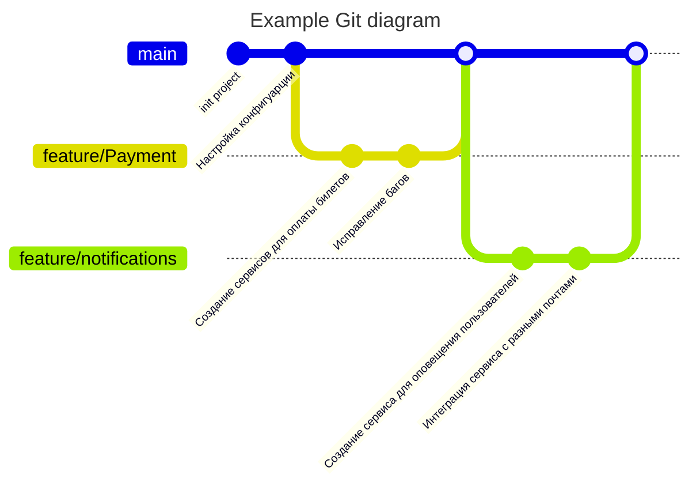
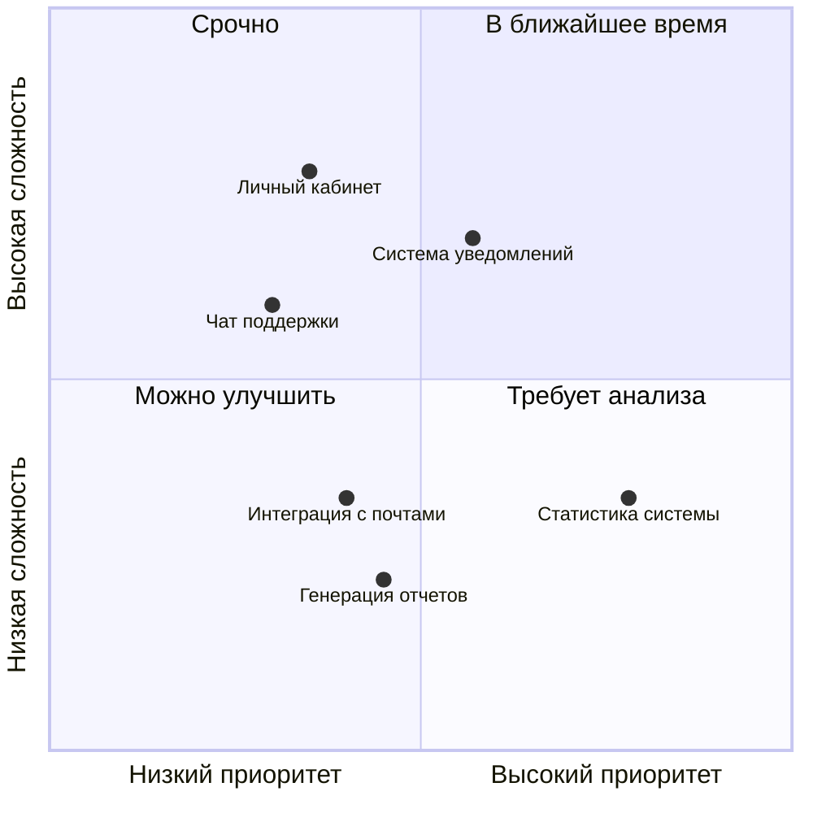

```mermaid
---
title: Example Git diagram
---
gitGraph 
   commit id:"init project"
   commit id: "Настройка конфигуарции"
   branch feature/Payment
   checkout feature/Payment
   commit id: "Создание сервисов для оплаты билетов"
   commit id: "Исправление багов"
   checkout main
   merge feature/Payment
   branch feature/notifications
   checkout feature/notifications
   commit id: "Создание сервиса для оповещения пользователей"
   commit id: "Интеграция сервиса с разными почтами"
   checkout main
   merge feature/notifications
```

```mermaid
quadrantChart
    x-axis "Низкий приоритет" --> "Высокий приоритет"
    y-axis "Низкая сложность" --> "Высокая сложность"
    quadrant-1 "В ближайшее время"
    quadrant-2 "Срочно"
    quadrant-3 "Можно улучшить"
    quadrant-4 "Требует анализа"
    "Чат поддержки": [0.3, 0.6]
    "Генерация отчетов": [0.45, 0.23]
    "Система уведомлений": [0.57, 0.69]
    "Статистика системы": [0.78, 0.34]
    "Интеграция с почтами": [0.40, 0.34]
    "Личный кабинет": [0.35, 0.78]
```
